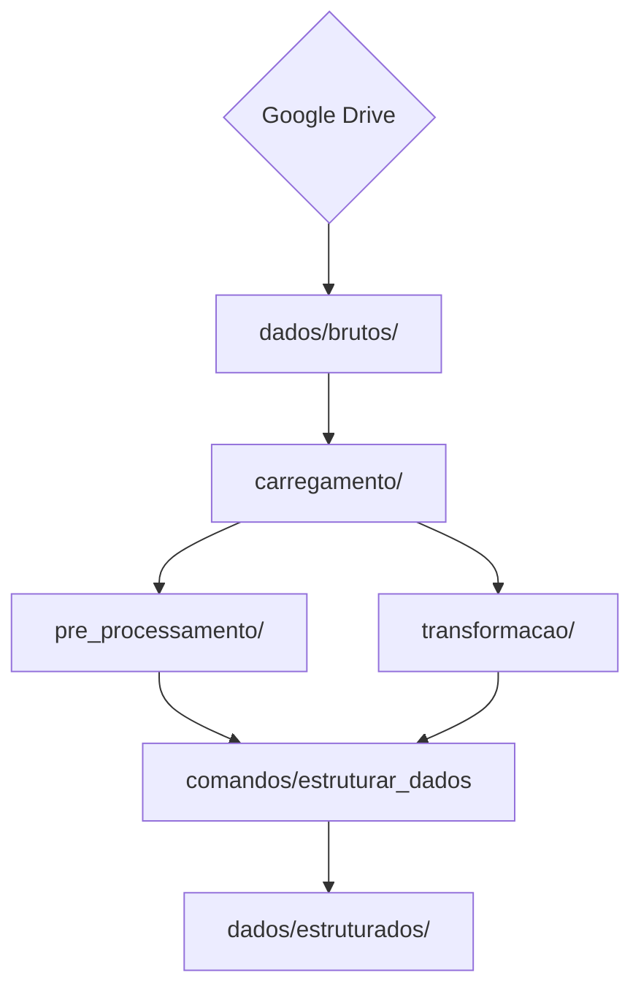
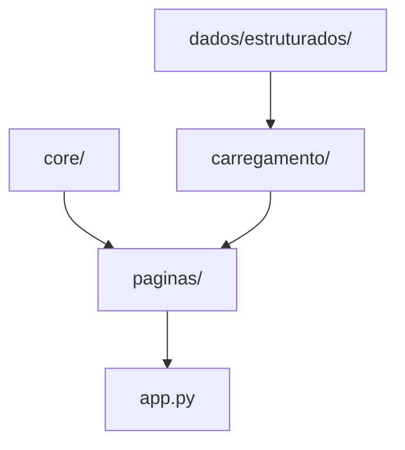
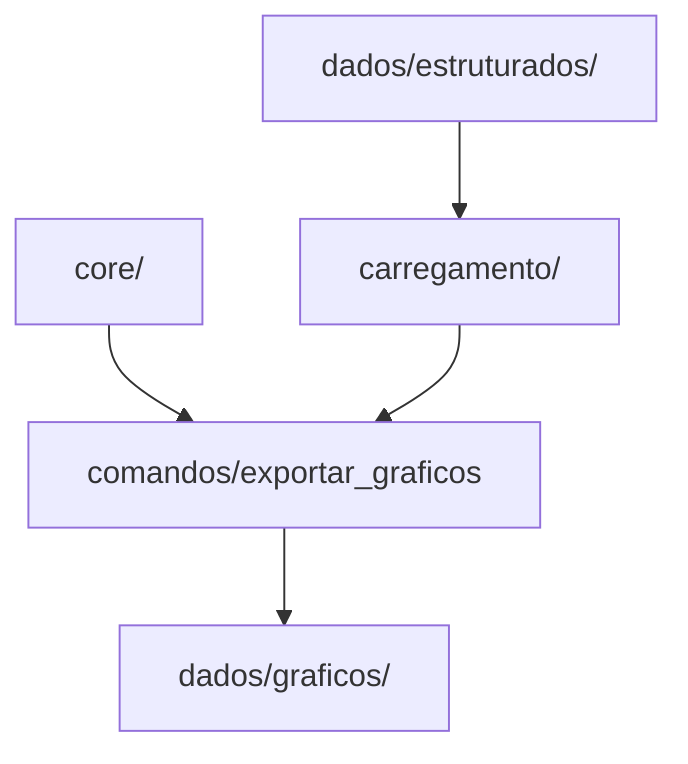
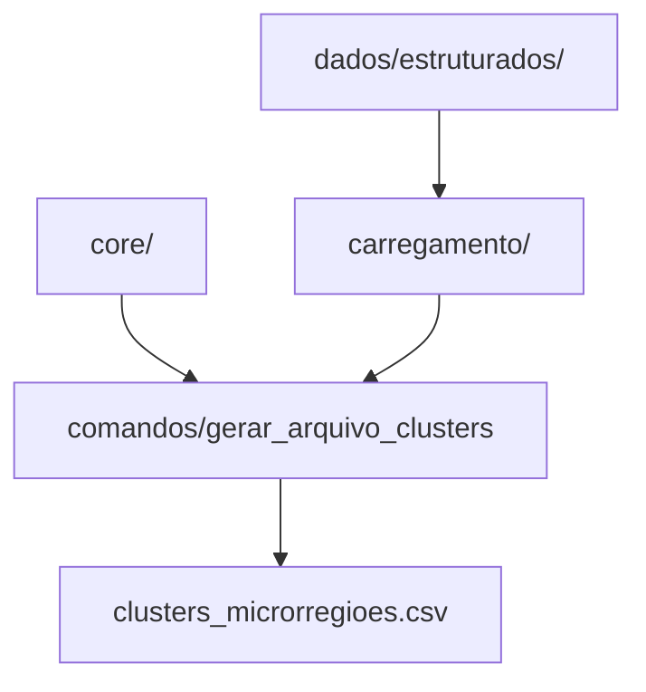

# Clusterização de microrregiões do Paraná para apoio à logística humanitária

Este repositório contém o código utilizado no artigo **Um estudo de caso de clusters por eventos climáticos extremos para apoiar ações de logística humanitária no estado do Paraná**.

O estudo analisa registros de desastres entre 2010 e 2024 fornecidos pela Coordenadoria Estadual de Defesa Civil do Paraná (CEDC/PR). O algoritmo K-Means é aplicado às 39 microrregiões do estado, utilizando três atributos construídos a partir de agrupamentos de tipos de desastres com perfis semelhantes de recebimento de materiais.

# Resumo das pastas

- Arquivos da Raiz
    - README.md: O arquivo explicatório central do projeto.
    - requirements.txt: A lista de dependências necessárias para rodar a aplicação.
    - .gitignore: O arquivo com as especificações de arquivos e diretórios (como as pastas de dados locais) para não serem monitorados pelo controle de versão do Git.
    - app.py: App streamlit para visualizar as análises durante o desenvolvimento.

- dados/: Armazenamento dos dados e outputs da aplicação.

- .streamlit/: Contém as configurações específicas da aplicação Streamlit.
- constantes/: Armazena caminhos de arquivo, estilos e outras constante que são utilizadas ao longo da aplicação.
- comandos/: Scripts executáveis como módulo, para realizar certas ações como criar a pasta de dados e exportar os gráficos.
- utils/: Implementa funções e classes auxiliares que são utilizadas ao longo da aplicação.
- carregamento/: Responsável pela leitura e carregamento dos dados para uso na aplicação.
- pre_processamento/: Executar processamento nos dados brutos.
- transformacao/: Executar transformação nos dados pré-processados.
- core/: Contém a lógica para executar as análises.
- visualizacoes/: Construção dos gráficos.
- paginas/: Organiza as análises concluídas em páginas que compõem a interface da aplicação.

# Partes da aplicação

## Preparação dos dados

Em um ambiente virtual ativo e com as dependências instaladas, executar:
```bash
python3 -m comandos.criar_pasta_de_dados
```
Após isso, mover os dados do drive para `dados/brutos/`.

Para transformar os dados execute
```bash
python3 -m comandos.estruturar_dados
```



## Visualização das análises

Para gerar a aplicação streamlit execute:
```bash
streamlit run app.py
```



## Exportação dos resultados

Para exportar os gráficos execute:
```bash
python3 -m comandos.exportar_graficos
```



## Obter clusters das microrregiões

Para obter os clusters das microrregiões execute:
```bash
python3 -m comandos.gerar_arquivo_clusters
```




