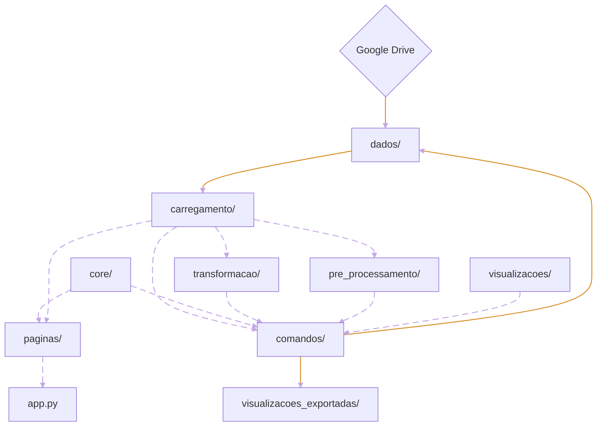

# Arquitetura do projeto

## Resumo das pastas

- Arquivos da Raiz
    - README.md: O arquivo explicatório central do projeto.
    - requirements.txt: A lista de dependências necessárias para rodar a aplicação.
    - .gitignore: O arquivo com as especificações de arquivos e diretórios (como as pastas de dados locais) para não serem monitorados pelo controle de versão do Git.
    - app.py: App streamlit para visualizar as análises durante o desenvolvimento.

- dados/: Armazenamento dos dados brutos e estruturados.

- .streamlit/: Contém as configurações específicas da aplicação Streamlit.
- constantes/: Armazena caminhos de arquivo, estilos e outras constante que são utilizadas ao longo da aplicação.
- comandos/: Scripts executáveis como módulo, para realizar certas ações como criar a pasta de dados e exportar os gráficos.
- utils/: Implementa funções e classes auxiliares que são utilizadas ao longo da aplicação.
- carregamento/: Responsável pela leitura e carregamento dos dados para uso na aplicação.
- pre_processamento/: Executar processamento nos dados brutos.
- transfomacao/: Executar transformação nos dados pré-processados.
- core/: Contém a lógica para executar as análises.
- visualizacoes/: Construção dos gráficos.
- paginas/: Organiza as análises concluídas em páginas que compõem a interface da aplicação.

## Relações 

- Linhas roxas pontilhadas ($v \to w$): $w$ importa de $v$.
- Linhas amarelas sólidas ($v \to w$): $v$ edita/alimenta $w$.



# Setup 

## Sobre o Git

Para clonar o repositório é necessário ter o Git instalado no computador. No site da plataforma
eles tem tutoriais sobre como fazer isso em cada sistema operacional.

Caso seja a primeira vez usando Git no computador, será necessário definir um nome de usuário:
```bash
git config --global user.name "Seu Nome"
```
e um e-mail:
```bash
git config --global user.email "seu.email@exemplo.com"
```

## Setup inicial

Este projeto usa a versão Python 3.12.3 .

Clone o repositório:
```bash
git clone https://github.com/gustavoalarcao/clustering_parana
```

Faça a pasta com o repositório ser o diretório ativo:
```bash
cd clustering_parana
```

Na pasta com o repositório, crie e ative um ambiente virtual:
```bash
# Ubuntu / Debian / MacOS
python3 -m venv .venv
source .venv/bin/activate

# Windows
python -m venv .venv
.venv\Scripts\activate
```

Instale as dependências do projeto no ambiente virtual:
```bash
# Ubuntu / Debian / MacOS
pip3 install -r requirements.txt

# Windows
pip install -r requirements.txt
```

Crie a pasta de dados:
```bash
# Ubuntu / Debian / MacOS
python3 -m comandos.criar_pasta_de_dados

# Windows
python -m comandos.criar_pasta_de_dados
```
e adicione os arquivos do drive em "dados/brutos".

Para executar as transformações nos arquivos execute:
```bash
# Ubuntu / Debian / MacOS
python3 -m comandos.estruturar_dados

# Windows
python -m comandos.estruturar_dados
```

Para exportar os gráficos execute:
```bash
# Ubuntu / Debian / MacOS
python3 -m comandos.exportar_graficos

# Windows
python -m comandos.exportar_graficos
```
os resultados ficarão armazenados em visualizacoes/exportadas.

Para visualizar o app:
```bash
streamlit run app.py
```

## Procedimento padrão 

```bash
# Ubuntu / Debian / MacOS
cd clustering_parana
source .venv/bin/activate
streamlit run app.py

# Windows
cd clustering_parana
.venv\Scripts\activate
streamlit run app.py
```


